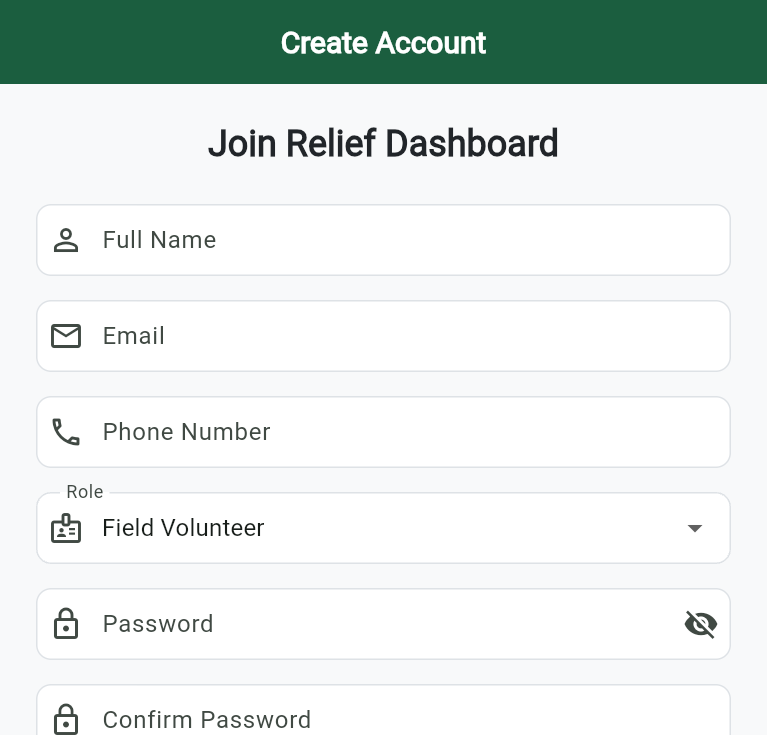
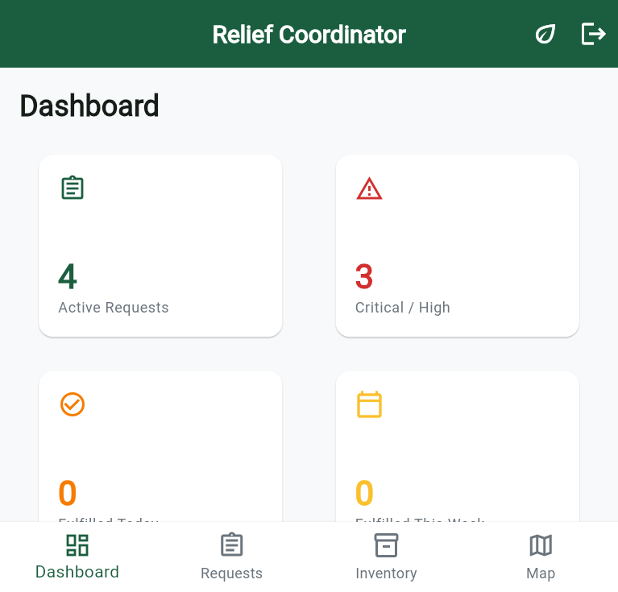
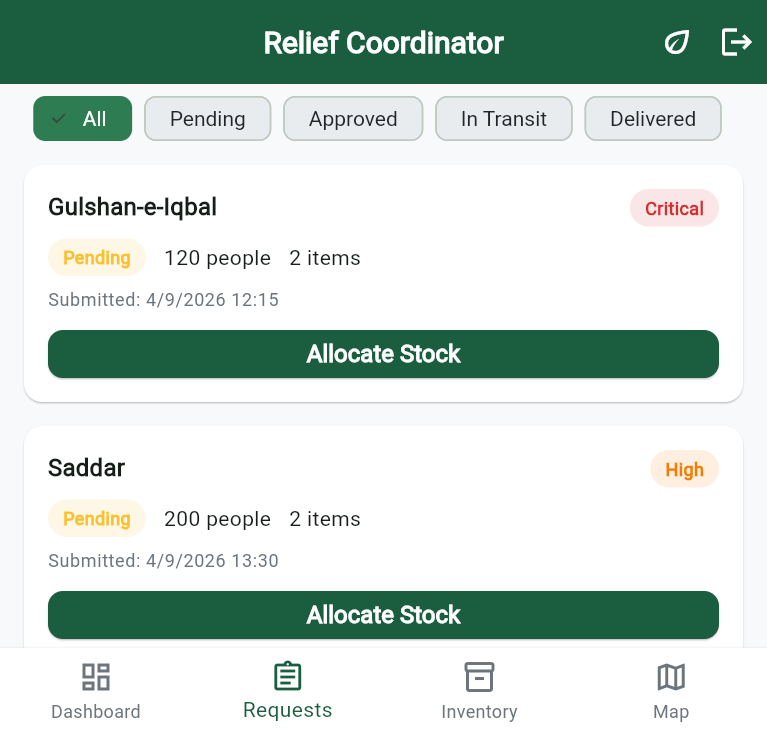
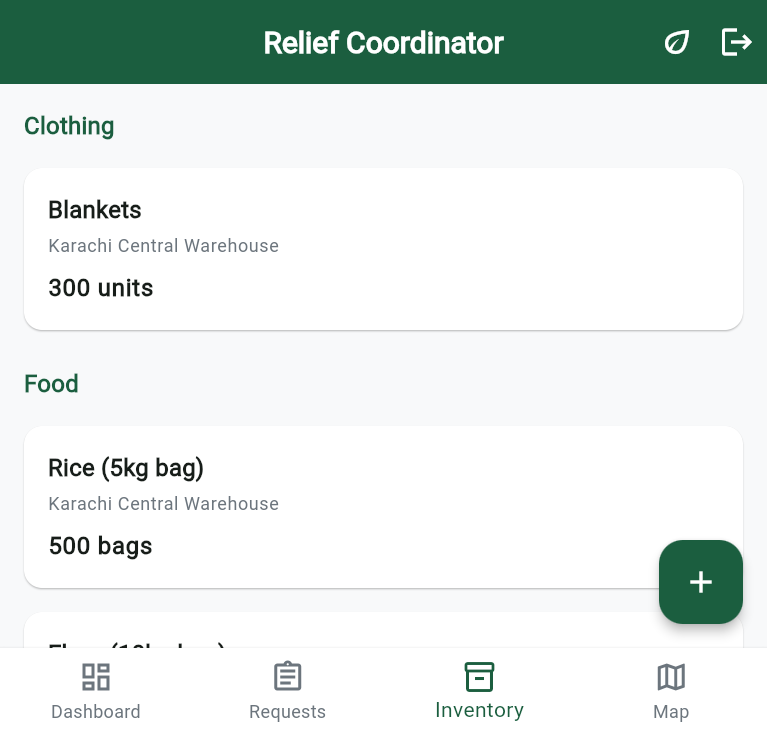
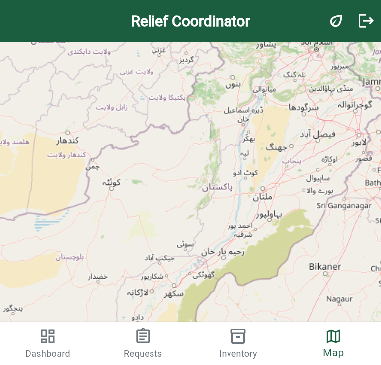
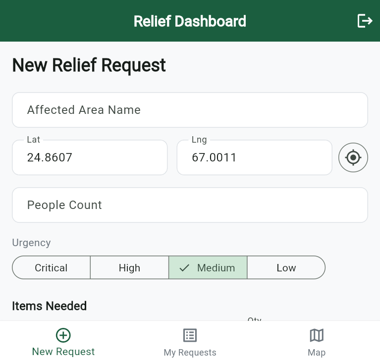
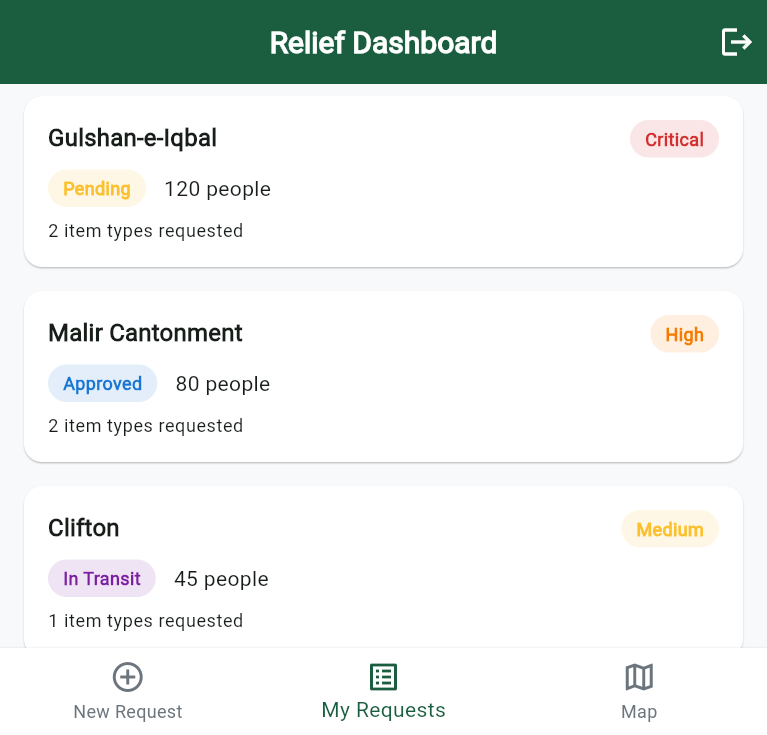
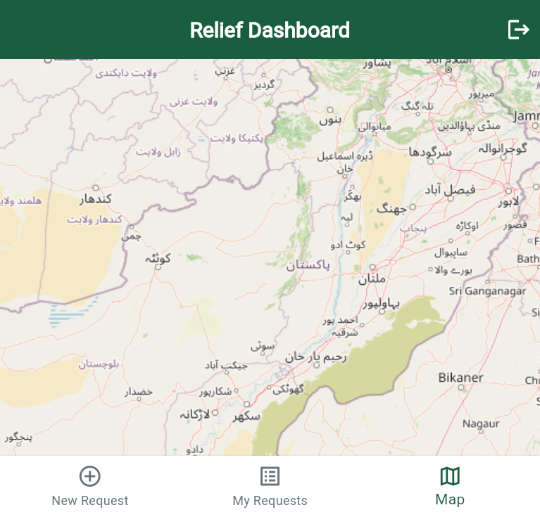

# Relief Dashboard

A Flutter disaster relief logistics application that coordinates relief supplies between field volunteers and coordinators/admins. It supports real time inventory tracking, relief request submission, stock allocation, interactive maps, and analytics dashboards.

This is the root of the project. The Flutter application itself lives in [dashboard/](dashboard/), and its full setup and usage documentation is in [dashboard/README.md](dashboard/README.md).

For an overview of the problem, solution, impact, technology, and what has been built, see [PRESENTATION.md](PRESENTATION.md).

## Overview

Field volunteers submit relief requests with location, photo evidence, urgency level, and needed items. Coordinators and admins review requests in real time, manage warehouse inventory, and allocate stock, all backed by a live Firebase data layer.

## Screenshots

### Authentication

Account creation screen where users select their role: admin/coordinator or field volunteer.

### Coordinator / Admin

Analytics dashboard showing active requests, critical/high priority counts, and a requests by status bar chart.

Relief request list with status filtering and one tap stock allocation.

Inventory grouped by category with warehouse and low stock information.

Interactive map showing warehouses and active relief requests by urgency.

### Field Volunteer

New relief request form with location coordinates, urgency level, and items needed.

List of submitted requests with real time status tracking.

Map view of submitted request locations.

## Tech stack

- Flutter and Dart
- Firebase Core, Authentication, Cloud Firestore, Storage
- `provider` for state management
- `flutter_map` and `latlong2` for maps
- `fl_chart` for analytics
- `image_picker` and `geolocator` for volunteer requests

## Getting started

See [dashboard/README.md](dashboard/README.md) for full setup instructions, including Firebase configuration, security rules, demo credentials, and how to run the app.

## License

This project is for educational and demonstration purposes.
